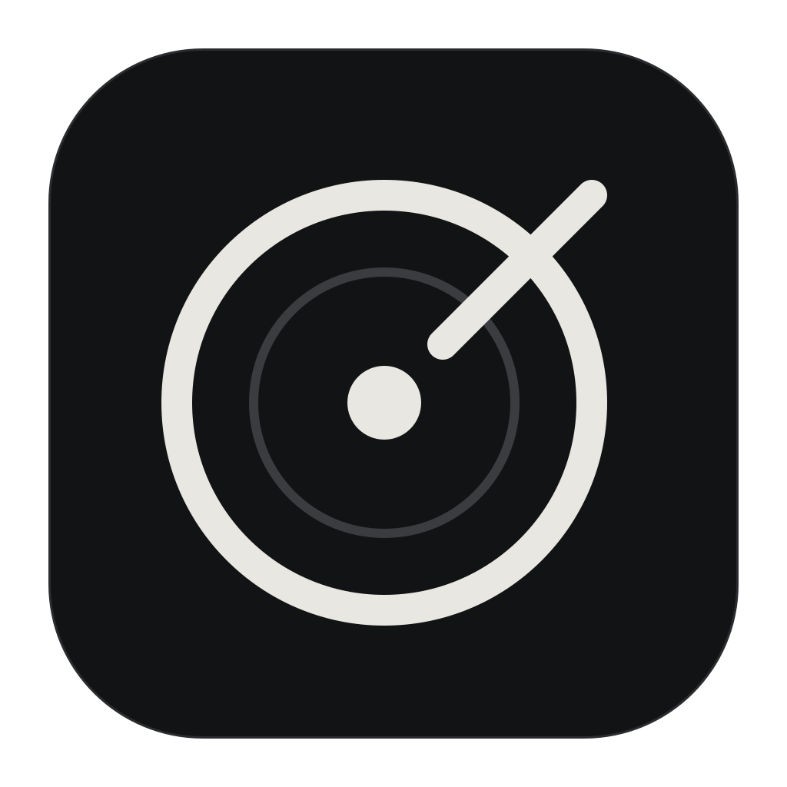
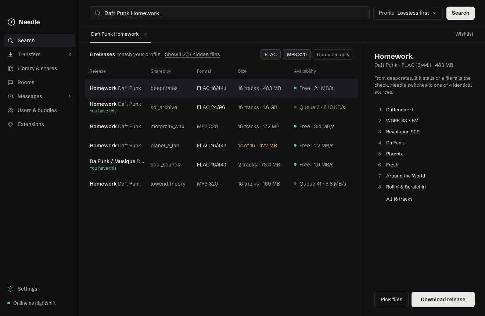
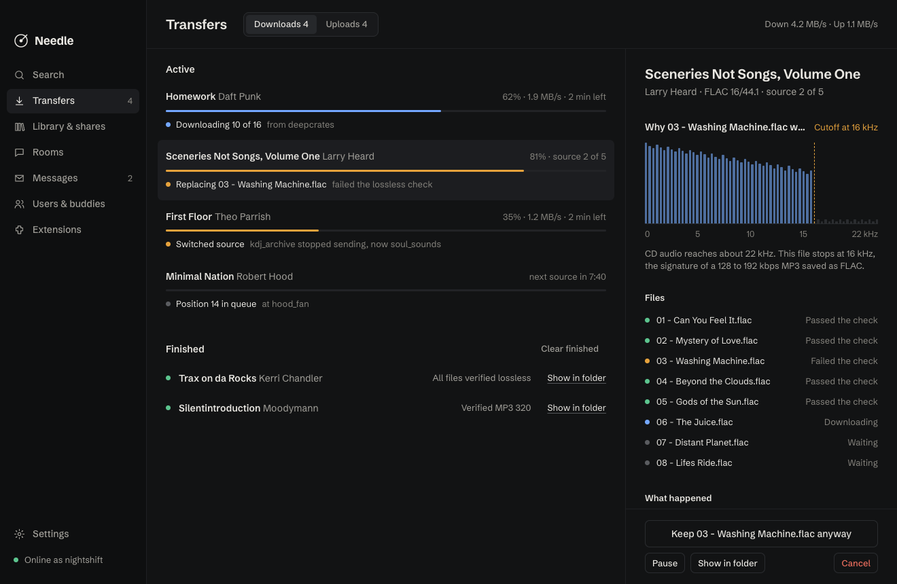

<p align="center">
  
</p>

<h1 align="center">Needle</h1>

<p align="center">
  A Soulseek client that finds the real thing.<br>
  Everything Nicotine+ does, with an interface that gets out of the way.
</p>

<p align="center">
  <a href="https://github.com/dylannoor/needle/actions/workflows/ci.yml"></a>
  <a href="LICENSE"></a>
</p>



## Why

Soulseek is still the best place to find music that isn't anywhere else. The
clients haven't kept up: you scroll through thousands of loose files, babysit
downloads that sit in someone's queue forever, and find out a week later that
the FLAC you grabbed is an MP3 in disguise.

Needle fixes the parts that cost you time.

**Tell it what good enough means, once.** A quality profile is a ranked list
like "FLAC 24-bit, then FLAC 16-bit, then MP3 320". Needle comes with two:
Lossless first, and Storage first for when disk space matters (MP3 320, then
FLAC, then AIFF). Make your own from either. Search results are filtered
by it, sources are picked by it, and every download is checked against it.

**Releases, not files.** Results are grouped per folder into releases. When
other people share an identical copy, they become backup sources. Everything
below your profile is hidden and counted, one click away if you want it.

**Downloads that look after themselves.** If a source stops sending data or
keeps you waiting in its queue, Needle switches to the next one that has the
same files. When every source is used up it searches again, and as a last
resort it puts the album on your wishlist. Each decision is written down on
the transfer in plain language, so you always know what happened.

**Every file gets checked.** When a download finishes, Needle reads the header
and looks at the spectrum. A lossless file that stops at 16 kHz is a 128 kbps
MP3 someone saved as FLAC, and it gets thrown out and fetched from someone
else. You choose how strict it is.



## Everything else you expect

Searching the whole network, a single user or a room, with exclusions and
history. A wishlist that keeps searching for you. Uploads with slots and a
queue, shared folders with rescans, browsing other people's shares, user
profiles, buddies with notes, ban and ignore lists, chat rooms, private
messages, interests and recommendations, away status and automatic port
mapping over UPnP.

## Extensions

Extensions are small JavaScript workers that react to what happens in Needle.
They run sandboxed and can only touch what their manifest asks for, which you
see before you turn one on.

Needle ships with one: **Rekordbox**. It adds every download that passes the
quality check to a Needle playlist in a `rekordbox.xml` file, which Rekordbox
picks up through its XML import. It never touches Rekordbox's own database.

Writing your own is a single folder with a manifest and a script. See
[docs/extensions.md](docs/extensions.md).

## Install

There are no release builds yet. To run Needle from source you need
[Rust](https://rustup.rs) 1.91 or newer, [Node](https://nodejs.org) 22 and
[pnpm](https://pnpm.io), plus the
[Tauri prerequisites](https://v2.tauri.app/start/prerequisites/) for your
system.

```sh
git clone https://github.com/dylannoor/needle
cd needle
pnpm install
pnpm tauri dev
```

Log in with your Soulseek account, or pick any new username and password to
create one. Please share something back: Soulseek works because people do.

## Development

```sh
pnpm dev                  # the interface in a browser, against a mock backend
cargo test --workspace    # Rust tests, also regenerates src/bindings
pnpm test                 # frontend tests
```

The code is split in three:

- `crates/needle-core` makes every decision: grouping results, matching
  profiles, the download state machine and the audio check. It has no network
  or UI code, so it is quick to test.
- `src-tauri` is the app. It talks to the Soulseek network through
  [soulseek-rs-lib](https://github.com/michel/soulseek-rs), keeps state in
  SQLite and hosts extensions.
- `src` is the React interface.

Every command and event between them is listed in [docs/ipc.md](docs/ipc.md),
and [docs/spec.md](docs/spec.md) explains the design. Read
[CONTRIBUTING.md](CONTRIBUTING.md) before opening a pull request.

## Known limits

Some things depend on features soulseek-rs-lib doesn't have yet. Needle shows
them honestly instead of pretending: queue lengths in search results, an upload
speed limit, folders shared with buddies only, buddies first in the upload
queue, and profile pictures. These are good first contributions upstream.

## Thanks

Needle stands on [soulseek-rs-lib](https://github.com/michel/soulseek-rs) by
Michel de Graaf, the
[protocol documentation](https://nicotine-plus.org/doc/SLSKPROTOCOL.html)
kept by the [Nicotine+](https://nicotine-plus.org) team, and everyone who has
kept Soulseek alive for more than twenty years.

## License

[GPL-3.0-or-later](LICENSE).
